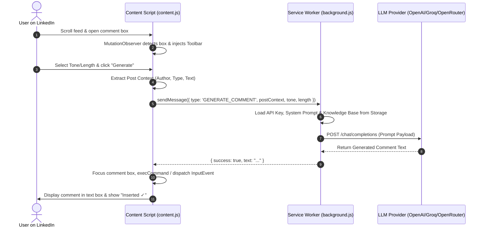

# LinkedIn Comment Writer Agent — Architecture & Technical Guide

**LinkedIn Comment Writer Agent** is a privacy-first, Manifest V3 Chrome Extension designed to generate highly contextual, personalized, and engaging comments on LinkedIn posts using your own LLM API keys.

---

## 🌟 Key Features

* **Direct DOM Injection**: Injects an intuitive `✨ Generate` button, Tone selector, and Length selector directly inside LinkedIn comment boxes as you browse your feed.
* **Multi-LLM Provider Support**: Native integration with:
  * **OpenAI** (`gpt-4o`, `gpt-4o-mini`, `o1`, `o3-mini`, etc.)
  * **Groq** (`llama-3.3-70b-versatile`, `mixtral-8x7b-32768`, `deepseek-r1-distill-llama-70b`, etc.)
  * **OpenRouter** (Access to Claude 3.5 Sonnet, Gemini 2.0 Flash, DeepSeek R1, Llama 3, etc.)
  * **Custom Endpoints** (Any OpenAI-compatible server such as LM Studio, Ollama, LocalAI, or vLLM).
* **Zero-Server Privacy Model**: Bring Your Own Key (BYOK). All API keys and settings are stored locally in `chrome.storage.local`. Requests go directly from your browser to the LLM API provider — no middleman or proxy servers.
* **4-Tier Context Extraction Waterfall**: Robust, resilient post-text extraction engine that handles LinkedIn's dynamic DOM class updates, video/image/poll posts, and nested comments.
* **Personalized Knowledge Engine**: Incorporate background info about your profession, role, company, expertise, or personal brand tone so generated comments sound uniquely like you.
* **React Synthetic Event Dispatching**: Automatically updates LinkedIn's draft state so the native "Post" button activates seamlessly.

---

## 📁 Repository Structure

```
linkedin-comment-writer-extention/
├── manifest.json         # Extension Manifest V3 configuration & permissions
├── background.js         # Background Service Worker handling API calls & routing
├── ABOUT.md              # Project technical & workflow documentation
├── content/
│   ├── content.js        # MutationObserver, DOM injection, context extraction & insertion
│   └── content.css       # Injected toolbar styling & micro-animations
├── lib/
│   ├── providers.js      # LLM provider configs, model fetching & Chat Completion handler
│   └── storage.js        # Typed chrome.storage.local helper functions
├── popup/
│   ├── popup.html        # Settings extension popup UI layout
│   ├── popup.js          # Popup controller (auto-save, provider switcher, model fetcher)
│   └── popup.css         # Modern dark-mode popup stylesheet with custom components
└── icons/                # Extension icon assets (16x16, 48x48, 128x128)
```

---

## 🏗️ Architecture & Component Roles

### 1. `manifest.json` (Extension Configuration)
* **Manifest Version**: 3
* **Permissions**: `storage`, `activeTab`, `scripting`
* **Host Permissions**: `https://www.linkedin.com/*`, `https://api.openai.com/*`, `https://api.groq.com/*`, `https://openrouter.ai/*`, plus optional custom domains.
* **Content Scripts**: Injected into `https://www.linkedin.com/*` at `document_idle`.

### 2. `content/content.js` (DOM Controller & Post Scanner)
* **MutationObserver**: Continually watches the LinkedIn feed DOM for newly rendered comment boxes (`div[contenteditable="true"]`).
* **Toolbar Injection**: Appends a toolbar containing:
  * `✨ Generate` / `↻ Regenerate` button
  * Tone selector (`Professional`, `Casual`, `Witty`, `Supportive`, `Analytical`, `Contrarian`)
  * Length selector (`Short`, `Medium`, `Long`)
* **Context Extraction Engine**: Uses a multi-tiered approach to extract the author, post type, and post text without getting tricked by UI labels, comment lists, or social action counts.
* **Text Insertion & Event Triggering**: Inserts generated text into LinkedIn's `contenteditable` container using `document.execCommand('insertText')` or `InputEvent` dispatches to simulate human typing and trigger React state changes.

### 3. `background.js` (Background Service Worker)
* Acts as a secure background bridge for network requests (avoiding CORS and CSP issues inside content scripts or popups).
* Listens for messages from `content.js` and `popup.js`:
  * `GENERATE_COMMENT`: Reads settings from storage, constructs system/user prompt payloads, calls `callChatCompletion()`, and returns the output.
  * `FETCH_MODELS`: Calls `fetchModels()` for the active provider and returns available model IDs.

### 4. `lib/providers.js` (LLM Provider Abstraction)
* Standardizes endpoint schemas across OpenAI, Groq, OpenRouter, and Custom OpenAI-compatible backends.
* Handles response parsing across multiple LLM response formats:
  * Standard string `message.content`
  * Array of text blocks (e.g., Anthropic models via OpenRouter)
  * Reasoning models (e.g., OpenAI `o1`/`o3` or Groq DeepSeek models using `reasoning_content`)

### 5. `lib/storage.js` (Persisted State Management)
* Promisified wrapper around `chrome.storage.local`.
* Stores user preferences: `extensionEnabled`, `provider`, `apiKey`, `baseUrl`, `model`, `systemPrompt`, `knowledgeBase`, `tone`, `length`.

### 6. `popup/` (Settings Dashboard)
* Provides a sleek settings interface to configure API keys, test provider connections, fetch models dynamically, and define system prompts and personal background information.
* Features real-time auto-saving with debouncing (250ms) and status feedback.

---

## ⚡ How It Works: Step-by-Step Flow



---

## 🧠 Post-Context Extraction Strategy

To handle LinkedIn's obfuscated and frequently updated CSS class names, `content.js` implements a **4-tier extraction waterfall**:

1. **Tier 1 (Targeted Container Resolution)**:
   * Finds the post card container (`.feed-shared-update-v2`, `article`, `[data-urn*="urn:li:activity"]`).
   * Automatically triggers "See more" text expansion if present.
   * Extracts post author name and identifies media type (Poll, Article, Image, Video, Document).
2. **Tier 2 (Parent Clone Scanner)**:
   * Climbs up parent nodes, clones the element, and strips out actor headers, reaction counts, and comment sub-trees to isolate post body text.
3. **Tier 3 (Page-Level Proximity Fallback)**:
   * Computes bounding rectangle distances between the active comment box and text blocks on page to find the nearest parent post text.
4. **Tier 4 (Guaranteed Fallback Clone)**:
   * Clones the highest parent container, strips interactive UI tags, and extracts remaining text content.

---

## 🛠️ System & Prompt Engineering Architecture

When a user triggers comment generation, the extension constructs a two-part prompt structure:

### System Message
```text
<Base System Prompt or Default Prompt>

Tone: write in a <tone> tone.
Length: keep the comment <length description>.
Only output the comment text itself — no preamble, no quotation marks, no explanation, no hashtags unless naturally appropriate.
```

### User Message
```text
Here is background information about me:
<Knowledge Base text from storage>

Here is the LinkedIn post I want to comment on:
Author: <Author Name>
Post type: <Post Type>
Post content:
<Extracted Post Text>

Write a comment I can post as a reply to this.
```

---

## 🔒 Security & Privacy Model

* **Local Storage Only**: API keys are saved exclusively in `chrome.storage.local` on your local browser profile.
* **Direct Network Calls**: Network requests are dispatched directly from your browser to the provider (`api.openai.com`, `api.groq.com`, `openrouter.ai`, or your custom endpoint).
* **No Telemetry**: No user data, post content, or generated comments are sent to external analytics or telemetry services.

---

## 🚀 Setup & Installation Guide

1. **Clone / Download Repository**:
   Ensure all extension files are placed in a dedicated folder.
2. **Open Chrome Extensions**:
   Navigate to `chrome://extensions/` in your browser.
3. **Enable Developer Mode**:
   Toggle the **Developer mode** switch in the top right corner.
4. **Load Unpacked Extension**:
   Click **Load unpacked** and select the `linkedin-comment-writer-extention` directory.
5. **Configure Extension**:
   * Click the extension icon in your Chrome toolbar.
   * Select your preferred LLM **Provider** (OpenAI, Groq, OpenRouter, or Custom).
   * Enter your **API Key**.
   * Click **Fetch Models** and select your model.
   * Customize your **System Prompt** and **Knowledge Base** (optional, but recommended).
6. **Start Browsing LinkedIn**:
   Open [LinkedIn](https://www.linkedin.com/), scroll to any post, click on a comment box, and click **✨ Generate**.

---

## ❓ Troubleshooting & FAQs

* **"Extension was updated — please refresh this LinkedIn page"**:
  Occurs when the extension is reloaded in `chrome://extensions/` while a LinkedIn page is active. Refresh the LinkedIn tab (F5 / Ctrl+R) to re-inject the content script.
* **"Could not read the post content"**:
  Scroll the target post completely into view and click **Generate** again.
* **"No models found / Invalid API key"**:
  Double-check your API key and verify that your provider account has active credits or quota.
* **"Response cut off (max_tokens reached)"**:
  Change your length default to `Short` or `Medium` in the extension popup.
